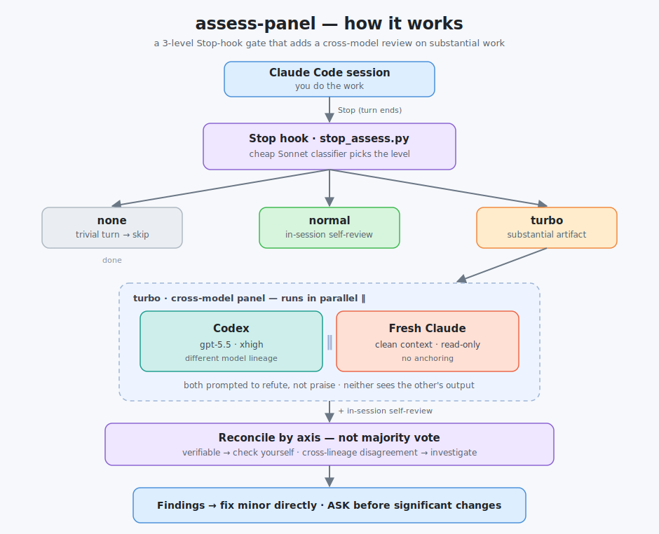

# assess-panel

A multi-model "second opinion" for the `/assess` quality gate.

Today `/assess` is Claude reviewing its own work. This adds a third level where a
substantial change is also checked by **Codex** and by a **fresh Claude**, in
parallel, before the task is considered done.



## Three levels (the Stop hook picks one automatically)

- **none** — trivial turn (a reply, a tiny edit). No review.
- **normal** — real but bounded work (a function, a bugfix). Claude reviews its own
  work in-session — the existing behavior.
- **turbo** — a substantial artifact was produced (new module, big refactor, full
  report). On top of the self-review, runs a cross-model panel and reconciles it.

A cheap classifier (Sonnet, low effort) decides the level on every Stop.

## Why the two extra reviewers

- **Codex (gpt-5.5)** — a different model lineage. Catches blind spots that Claude
  shares across all of its own runs.
- **Fresh Claude (clean context)** — same model, but no priming. Catches anchoring
  and "solved the wrong problem" that the working session can't see by itself.

They cover different kinds of error, so they are not redundant.

## How findings are combined

Not by majority vote (two of the three voices are the same lineage and correlate).
Reconcile by axis instead:

- verifiable finding (a real bug, a failing case, a spec mismatch) → check it, fix if real;
- a finding one reviewer raised and the other missed → investigate it (cross-lineage
  disagreement is signal, not a minority to overrule);
- both agree it's fine → high confidence, move on.

## Files

- `hooks/stop_assess.py` — the 3-level gate.
- `skills/assess/SKILL.md` — review instructions, normal + turbo branches.
- `skills/assess/panel.sh` — runs the two reviewers in parallel on an artifact.
- `install.sh` — symlinks the hook + skill into `~/.claude/` (backs up existing first).

## Install

Review the files, then:

```bash
bash install.sh
```

Nothing in your live Claude Code setup changes until you run it. It backs up the
current `~/.claude/hooks/stop_assess.py` and `~/.claude/skills/assess`, then symlinks
this repo in their place, so edits here go live immediately.

The Stop hook is already registered in `~/.claude/settings.json`
(`python3 ~/.claude/hooks/stop_assess.py`), so no settings change is needed.

## Notes

- Codex model and effort come from `~/.codex/config.toml` (currently gpt-5.5 / xhigh).
- Both verifiers run **read-only** — they cannot edit your files.
- Panel timeout per reviewer defaults to 300s (`ASSESS_PANEL_TIMEOUT` to override).
- Herd is untouched. This may later be exposed there as a "verify with the other
  model" button, reusing the same `panel.sh`.
