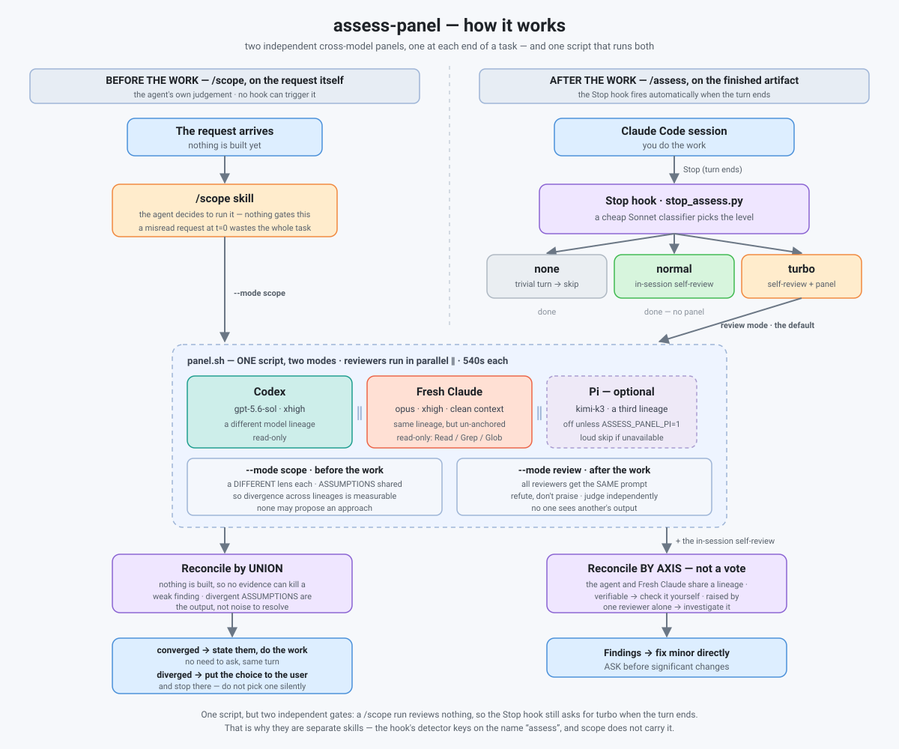

# assess-panel

**A review step for [Claude Code](https://docs.anthropic.com/en/docs/claude-code) that brings in a *different* AI model and a *fresh, un-primed* instance to catch the mistakes the working agent can't see by itself — after substantial work (did it do this right?) or, on demand, before it starts (does it even know what you asked?).**

## The problem

When a coding agent finishes a task, the obvious quality check is to have it review its own work. That catches typos, off-by-ones, and forgotten edge cases — real but shallow mistakes. It does **not** catch two deeper failure modes:

- **Model-systematic blind spots.** Every run of the same model shares the same priors. If the model misjudges a class of problem, re-reading its own output misjudges it the same way — you can't out-think your own blind spot using the same brain.
- **Anchoring / "solved the wrong problem."** By the time it reviews, the session has already convinced itself what the task means and that it's done. Reviewing inside that same context inherits the misunderstanding.

## The idea

Add reviewers that **fail differently** from the working agent, so their mistakes don't line up with its blind spots:

- a **different model** — OpenAI's Codex — whose different training catches model-systematic errors; and
- a **fresh instance of the same model** with a clean context, which, never having seen the session's reasoning, catches anchoring and wrong-problem errors.

The point is not "a smarter reviewer." It's **decorrelation**: two checkers whose errors are independent of the author's. The chance all three miss the same bug is far lower than any one alone. Notably this holds *even if the reviewers are no more capable* than the working agent — independence, not capability, is what buys the catch.

Independent review costs tokens and time, so it's **gated**: a cheap classifier decides per turn whether the work is substantial enough to be worth it.

## What it is

Two pieces that plug into Claude Code:

- **An `/assess` skill** — a structured self-review (for code: correctness, edge cases, security, consistency; for research: sourcing and internal consistency; for plans: simplicity and completeness). You can run it by hand (`/assess`), or let the hook trigger it. `/assess scope` runs the before-work variant instead — see below.
- **A Stop hook** — a script Claude Code runs every time the agent finishes a turn. It can block the turn and tell the agent to do something first. Here it classifies the turn into one of three review levels.



## Three levels (the Stop hook picks one automatically)

- **none** — trivial turn (a reply, a tiny edit). No review.
- **normal** — real but bounded work (a function, a bugfix). The agent reviews its own work in-session.
- **turbo** — a substantial artifact was produced (a new module, a large refactor, a full report). On top of the self-review, it runs the cross-model panel below and reconciles everything.

A cheap classifier (Claude Sonnet, low effort) decides the level on every Stop. You can also force the deepest level yourself with `/assess turbo`.

## The turbo panel

`panel.sh` runs two independent skeptical reviewers **in parallel** (wall-clock ≈ the slower one, not the sum) over the same artifact:

- **Codex** — `gpt-5.6-sol` at `xhigh` effort; a different model lineage.
- **Fresh Claude** — a clean `claude -p` context, read-only tools (`Read`/`Grep`/`Glob`), no MCP.

Both are told to **find problems, not to praise**, and to judge independently. Neither sees the other's output or any prior review, so their errors stay decorrelated. The reviewer prompt is fixed inside the script (it's a guard — not something the orchestrator rewrites per call), and the *task* handed to them is the original request verbatim, never the agent's summary of what it did (a paraphrase would re-anchor them).

## How findings are combined (turbo)

Not by majority vote — two of the three voices are the same model lineage and correlate. Reconcile **by axis** instead:

- a **verifiable** finding (a real bug, a failing case, a spec mismatch) → check it yourself, fix if real;
- a finding **one reviewer raised and the other missed** → investigate it; cross-lineage disagreement is signal, not a minority to overrule;
- **both agree it's fine** → high confidence, move on.

## Scope: the same trick, before the work

`/assess scope` runs the same two reviewers at the *other* end of a task — on the request,
before anything is built. Decorrelation is worth more here: a misread request at t=0 wastes
the entire task, while a bug at t=1 wastes a fix.

But the question has to change. After the work there is an artifact, so "is this wrong?" is
decidable against evidence. Before it there is nothing to refute, and asking two models
"how should this be done?" just yields two plausible plans and no way to choose. So the
reviewers are asked what they think is being **asked**, never how to do it:

- **Codex** answers a fixed six-slot schema — deliverable, underlying question, assumptions,
  out of scope, done condition, most likely failure.
- **Fresh Claude** answers **assumptions** first, then runs a **pre-mortem** — wrong
  question, already done, tractability, hidden cost, misreading risk.

Different lenses on purpose. After the work, a fresh Claude earns its slot by being
un-anchored from a session that has convinced itself; at t=0 there is no such anchor, so an
identical prompt would make it a second copy of the working agent's own reading.

**Assumptions is the load-bearing slot, and the only one both reviewers answer.** When the
request is clear, everything else agrees; assumptions is where two independent readers reveal
that it wasn't — so it is the one place a genuine cross-lineage comparison exists, and it is
shared for exactly that reason. Every other slot is single-source by design, which does not
make it weak: the other reviewer was never asked, so its silence is not a dissent.

Aggregation **inverts**: union, not survival. Nothing is built, so there is no evidence to
kill a weak finding with, and the costs are lopsided — a false alarm takes one sentence to
dismiss, a missed misreading costs the whole task. Divergent assumptions are not noise to
resolve; they *are* the output, and they go back to the user as an explicit choice.

This also makes the panel domain-neutral. The slots hold for code, research, analysis,
writing, or a decision — only their contents change, so nothing has to classify the task
first. Two failure modes that barely exist in coding dominate elsewhere and get their own
slots: **tractability** ("the available data cannot support this claim") and the
**wrong-question** check ("the answerable version is adjacent to what you asked").

**When to run it.** Always, before **substantial research** — that is where wrong-question
and tractability findings are most common and most expensive, and where they expire fastest
once work begins. Otherwise: when a request describes an outcome rather than a change, when
it is expensive or hard to reverse, or when the agent notices itself filling in a blank the
user never specified. Skip it when the request already names the files or the exact question
— there is no ambiguity to find and the panel costs minutes.

Unlike the other levels this is **not** hook-triggered: the Stop hook fires when a turn
ends, by which point the moment for it has passed. The agent decides to run it, from the
skill's own description — so nothing extra needs registering, but it is judgement rather
than a gate.

A scope run always **ends the turn**, whether the readings converged or not. Partly that is
the point (a divergence is a question for you, not something to resolve alone), and partly
it is load-bearing: the Stop hook counts any `/assess` launch as "a review already ran," so
work done in the same turn as a scope run would reach Stop with that flag spent and ship
with no review at all.

## Requirements

- **Claude Code** (`claude` CLI), authenticated.
- **Codex** (`codex` CLI ≥ 0.144), authenticated. Model and effort are pinned to `gpt-5.6-sol` / `xhigh` (override with `ASSESS_CODEX_MODEL` / `ASSESS_CODEX_EFFORT`).
- macOS or Linux (the hook and `panel.sh` are bash + standard tools).

## Files

- `hooks/stop_assess.py` — the 3-level gate (the Sonnet classifier).
- `skills/assess/SKILL.md` — the instructions: normal + turbo branches, and the scope branch.
- `skills/assess/panel.sh` — runs the two reviewers in parallel. `--mode review` (default) on a finished artifact; `--mode scope` on a request that hasn't been started.
- `install.sh` — symlinks the hook + skill into `~/.claude/` (backs up anything already there).

## Install

Review the files, then:

```bash
bash install.sh
```

It backs up any existing `~/.claude/hooks/stop_assess.py` and `~/.claude/skills/assess` into `~/.claude/backups/` (outside the skills dir, so backups don't show up as live skills), then symlinks this repo in their place (so edits here go live immediately). You must also register the Stop hook once in `~/.claude/settings.json`:

```json
{
  "hooks": {
    "Stop": [
      { "hooks": [ { "type": "command", "command": "python3 ~/.claude/hooks/stop_assess.py" } ] }
    ]
  }
}
```

## Notes

- Both reviewers run **read-only** — they cannot edit your files.
- `panel.sh` defaults to `--mode review`, so existing callers are unaffected; `--mode scope` (or `ASSESS_PANEL_MODE=scope`) selects the before-work panel. In scope mode the file argument is the *context* bundle rather than an artifact, and may be empty; the request itself is the second argument and is required.
- Scope is triggered by the agent's own judgement from the skill description, not by a hook — nothing to register beyond the Stop hook below.
- Per-reviewer timeout defaults to 540s (`ASSESS_PANEL_TIMEOUT` to override).
- The panel reviewers root in the project directory (`$PWD`, or `ASSESS_PANEL_ROOT`) so they can read the surrounding code, not just the artifact text.
- The hook prompts **at most once per stop-chain**: on any Stop that follows its own block (`stop_hook_active`), it approves — however the agent handled the prompt. This is what makes "assess the assessment" loops structurally impossible.
- The hook **fails open**: if the classifier CLI errors or times out, the turn is approved with a stderr note — an infra hiccup never manufactures a review demand.
- Turns with **no tool calls at all** (a reply, a recap, an explanation) are approved without classifying — there is no artifact to review.
